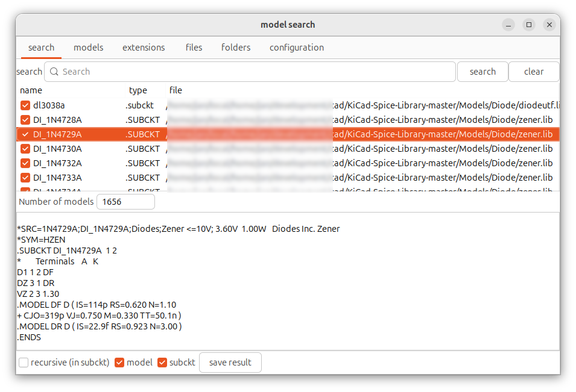

# simulation model retriever

intended to make finding models easy.
inspired by: https://github.com/kicad-spice-library/KiCad-Spice-Library

## targets
- search thru all text files and remember the extension.
- find .model and .subckt be aware of nesting
- with models mark the type (NMOS, NPN etc. and allow for exclusion)
- mark folder (allow for exclusion)
- mark extensions (allow for exclusion)
- no speed target
- try to keep comment before subckt (* only)
  - in most cases the comment is direct before the subckt or model

## views:

first page
- search entry with no wildchars (empty search all, literal string if found in name, bss finds BSS170 etc.) 
activate on button or enter, clear clears all searches
- checkbox for model recursion
  - must be checked to find models within .subckt 
- checkbox model (look for .model)
- checkbox subckt (look for .subckt)
- search result
  - simple list with found names
- extracted model with folder, file and extension
- multiple select to combine models
- save selected as new lib file

sec page
- list with found models (PNP, D etc), uncheck to repeat search without model.

third page
- file extension (uncheck to skip in next search) checkbox)

third page
- list with all files found (uncheck to skip file or clear when changing folder list)

fourth page
- list with folders with checkbox

fifth page 
- some configuration items like paths and encoding/codepage to use. edit toml file to add (valid) code pages
  - see  [codecs — Codec registry and base classes — Python 3.14.0 documentation](https://docs.python.org/3/library/codecs.html#codec-base-classes) for different codecs.

